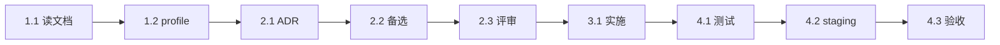

# Plan Execution

读 `.planning/current/task_plan.md`，自动生成：

1. 依赖图（DAG）
2. 里程碑（Milestones）
3. Checkpoints（用户确认点）
4. 风险预警

## Step 1: 解析 task_plan.md

读 subtasks，提取：
- ID（1.1, 1.2, ...）
- 名称
- 依赖（前置 subtask ID）
- 预估工时
- 风险等级

## Step 2: 构建 DAG



## Step 3: 识别里程碑

| M | 名称 | 包含 subtasks | 验收 |
|---|------|---------------|------|
| **M1** | 调研完成 | 1.1, 1.2 | 已写出 notes.md |
| **M2** | 设计批准 | 2.1, 2.2, 2.3 | ADR merged |
| **M3** | 实施完成 | 3.x | 所有测试通过 |
| **M4** | 部署完成 | 4.1, 4.2, 4.3 | PM 签字 |

每个 M 是"停下来确认"的点。

## Step 4: 关键路径

识别**关键路径**（决定总工时的最长路径）：

```
1.1 → 1.2 → 2.1 → 2.2 → 2.3 → 3.1 → 3.2 → 4.1 → 4.2 → 4.3
10m    20m    30m    20m    10m    1h     1h     30m    30m    30m
```

总关键路径 ≈ 5h

非关键路径可并行。

## Step 5: 输出执行计划

```markdown
## 执行计划

**总预估工时**: Xh (关键路径)
**最早完成**: YYYY-MM-DD (假设今天开始)
**里程碑**: 4 个

### M1: 调研完成 (预估 30min)
- 1.1 读文档
- 1.2 profile 现状

✅ 完成条件: notes.md 有 5+ 条发现

### M2: 设计批准 (预估 1h)
- 2.1 ADR 草案
- 2.2 备选方案
- 2.3 评审

✅ 完成条件: ADR merged + 2 approver

### M3: 实施完成 (预估 2h)
- 3.1 ...
- 3.2 ...

✅ 完成条件: 单元 + 集成测试通过，覆盖率 ≥ 85%

### M4: 部署完成 (预估 1.5h)
- 4.1 测试
- 4.2 staging
- 4.3 PM 验收

✅ 完成条件: PM 签字 + 文档更新

## 并行机会

- 1.1 完成后，调研可以分两路并行
- 3.x 实施可以多文件并行（如有）

## Checkpoints

🛑 在以下点停下问用户：
- M2 完成（设计批准）
- M3 完成（实施完成）
- 任何 subtask 失败
- 任何决策变更

## 风险预警

🔴 高风险：...
🟡 中风险：...

如触发风险，自动暂停并通知。
```

## Step 6: 写入 progress.md

把执行计划追加到 `.planning/current/progress.md` 的"度量"段。

## 与 update-progress 协作

执行时，每完成一个 subtask 调用 `update-progress` skill：
1. 更新 task_plan.md 复选框
2. 追加到 notes.md（如有发现）
3. 更新 progress.md 时间线 + 百分比
4. 进度变化时通知用户

## 反模式

❌ **不要**：
- 跳过 checkpoint 一路冲（容易跑偏）
- 风险评估完就不管（必须动态更新）
- 把里程碑当摆设（必须停下来确认）

✅ **应该**：
- 每个 M 都停下来
- 风险变了就更新计划
- 进度变化主动通知
