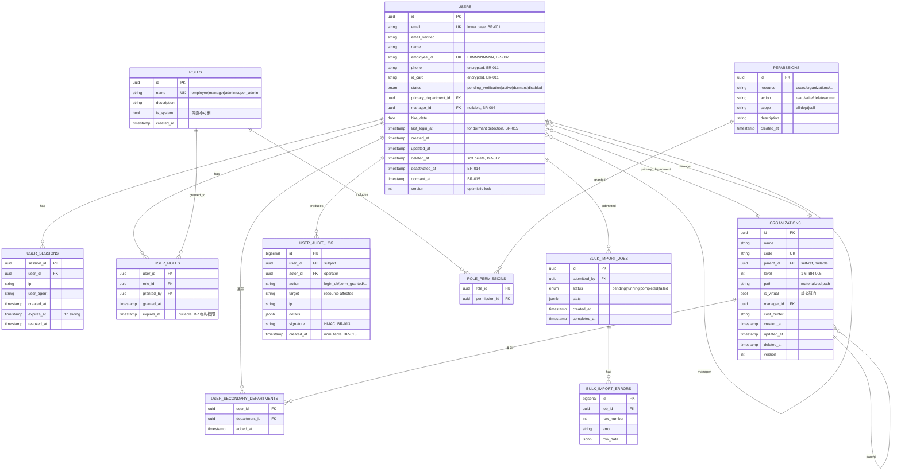

# 数据库 ER 图

> **最后更新**: 2026-06-21  
> **生成方式**: Mermaid + 手工绘制（与实际 DB 一致）

---

## 完整 ER 图



---

## 关键设计说明

### 1. 软删（Soft Delete）

所有主要表都有 `deleted_at`，**不物理删除**。BR-012 + 合规要求 7 年留存。

```sql
-- 查询时永远过滤
SELECT * FROM users WHERE deleted_at IS NULL;
```

### 2. 乐观锁（Optimistic Locking）

所有写入表都有 `version` 字段：

```sql
-- 更新时检查版本
UPDATE users SET name = ?, version = version + 1
WHERE id = ? AND version = ?;
-- 0 rows affected → 冲突
```

### 3. Materialized Path（组织树）

`organizations.path` 字段存储根到当前节点的路径：

```
公司:           /
├── 工程:       /engineering/
│   ├── 后端:   /engineering/backend/
│   └── 前端:   /engineering/frontend/
```

查询子树：
```sql
SELECT * FROM organizations
WHERE path LIKE '/engineering/%';
```

### 4. 自引用（Manager）

`users.manager_id` 引用 `users.id`，表示员工的直属上级。

```sql
-- 查某员工的所有下属（含间接）
WITH RECURSIVE reports AS (
  SELECT id, name, manager_id, 1 AS depth
  FROM users WHERE manager_id = $1 AND deleted_at IS NULL
  UNION ALL
  SELECT u.id, u.name, u.manager_id, r.depth + 1
  FROM users u JOIN reports r ON u.manager_id = r.id
  WHERE u.deleted_at IS NULL
)
SELECT * FROM reports;
```

### 5. 不可变审计日志

`user_audit_log` 表：
- **没有 UPDATE / DELETE 权限**
- **HMAC 签名**（BR-013 防篡改）
- 实际存储走 Kafka + S3，定期对账

---

## 索引策略

### 唯一索引

```sql
-- 用户表
CREATE UNIQUE INDEX ix_users_email 
  ON users (LOWER(email)) 
  WHERE deleted_at IS NULL;

CREATE UNIQUE INDEX ix_users_employee_id 
  ON users (employee_id);

-- 组织表
CREATE UNIQUE INDEX ix_organizations_code 
  ON organizations (code) 
  WHERE deleted_at IS NULL;

-- 角色表
CREATE UNIQUE INDEX ix_roles_name ON roles (name);

-- 权限表
CREATE UNIQUE INDEX ix_permissions_resource_action_scope 
  ON permissions (resource, action, scope);
```

### 普通索引

```sql
-- 用户常用查询
CREATE INDEX ix_users_primary_department 
  ON users (primary_department_id) 
  WHERE deleted_at IS NULL;

CREATE INDEX ix_users_manager 
  ON users (manager_id) 
  WHERE deleted_at IS NULL;

CREATE INDEX ix_users_status_active 
  ON users (status) 
  WHERE status = 'active' AND deleted_at IS NULL;

CREATE INDEX ix_users_last_login 
  ON users (last_login_at) 
  WHERE status = 'active';

-- 组织树
CREATE INDEX ix_organizations_parent 
  ON organizations (parent_id) 
  WHERE deleted_at IS NULL;

-- GIST 索引加速 LIKE '/engineering/%'
CREATE INDEX ix_organizations_path_gist 
  ON organizations USING GIST (path);

-- 审计日志（按时间 + user）
CREATE INDEX ix_audit_log_user_time 
  ON user_audit_log (user_id, created_at DESC);

CREATE INDEX ix_audit_log_action_time 
  ON user_audit_log (action, created_at DESC);
```

---

## 表大小估算

| 表 | 行数（2026） | 年增长 | 5 年后 |
|----|-------------|--------|--------|
| users | 5000 万 | +5% | 6380 万 |
| organizations | 5 万 | +0.5% | 5.1 万 |
| user_sessions | < 100 万（活跃） | 波动 | - |
| user_roles | 1 亿 | +5% | 1.28 亿 |
| user_audit_log | 100 亿 | +20 亿/年 | 200 亿 |

---

## 分区策略

大表分区（按时间）：

```sql
-- user_audit_log 按月分区
CREATE TABLE user_audit_log (...) PARTITION BY RANGE (created_at);

CREATE TABLE user_audit_log_2026_06 PARTITION OF user_audit_log
  FOR VALUES FROM ('2026-06-01') TO ('2026-07-01');
```

---

## 不变式 (Invariants) 的实现

| 不变式 | 实现层 |
|--------|--------|
| 邮箱唯一（忽略大小写，不含软删） | 唯一索引 |
| 工号唯一 | 唯一索引 |
| Manager 同部门 | DB trigger + 应用层 |
| 部门层级 ≤ 6 | DB trigger + 应用层 |
| PII 加密 | 应用层 + 列级加密 |
| 审计不可篡改 | 没有 UPDATE/DELETE 权限 + HMAC |
