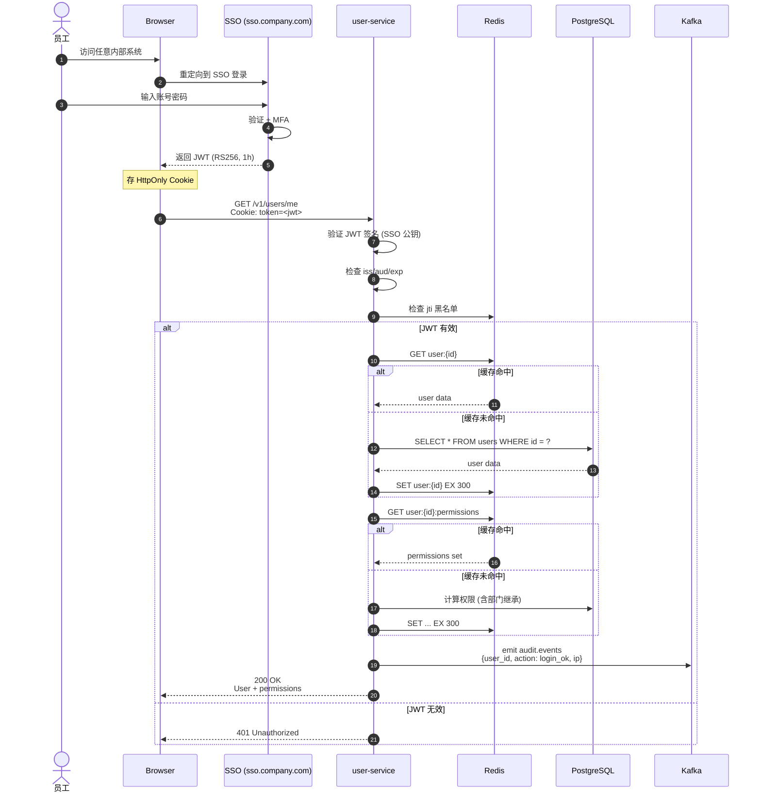

# 登录时序图

> 用户从 SSO 登录到调用 user-service API 的完整流程

---

## 标准登录流程



---

## 关键环节说明

### 1. JWT 验签（API 端）

```python
# 伪代码
def verify_jwt(token: str) -> User:
    # 1. 用 SSO 公钥验签（公钥从 JWKS endpoint 缓存）
    payload = jwt.decode(token, public_key, algorithms=["RS256"])
    
    # 2. 检查标准 claims
    assert payload['iss'] == 'sso.company.com'
    assert payload['aud'] in ALLOWED_AUDIENCES
    assert payload['exp'] > now()
    
    # 3. 检查 jti 黑名单（revoked tokens）
    jti = payload['jti']
    if await redis.exists(f"jwt:blacklist:{jti}"):
        raise RevokedToken
    
    # 4. 查用户
    user = await get_user(payload['sub'])
    if user.status != 'active':
        raise InactiveUser
    
    return user
```

### 2. 权限计算（含继承）

```python
async def calculate_permissions(user_id: UUID) -> set[str]:
    # 1. 用户的角色
    roles = await db.execute(
        select(Role).join(UserRole).where(UserRole.user_id == user_id)
    )
    role_names = {r.name for r in roles}
    
    # 2. 主部门的角色 + 父部门角色
    user = await get_user(user_id)
    dept = await get_org(user.primary_department_id)
    ancestors = await get_org_ancestors(dept.path)
    
    for ancestor in ancestors:
        dept_roles = await get_dept_roles(ancestor.id)
        role_names.update(dept_roles)
    
    # 3. 角色 -> 权限
    perms = await db.execute(
        select(Permission).join(RolePermission).where(
            RolePermission.role_id.in_(role_ids)
        )
    )
    
    return {f"{p.resource}:{p.action}:{p.scope}" for p in perms}
```

### 3. 缓存策略

| 数据 | TTL | 失效 |
|------|-----|------|
| `user:{id}` | 5 分钟 | 任何用户写操作 |
| `user:{id}:permissions` | 5 分钟 | 任何权限变更 |
| `jwt:blacklist:{jti}` | 24 小时 | JWT 过期后自动清 |

### 4. 审计事件

```json
{
  "event_id": "uuid",
  "event_type": "audit.events",
  "event_time": "2026-06-21T12:00:00Z",
  "producer": "user-service",
  "trace_id": "trace_abc",
  "payload": {
    "user_id": "uuid",
    "actor_id": "uuid",
    "action": "login_ok",
    "target": null,
    "ip": "10.0.1.5",
    "user_agent": "Mozilla/5.0 ...",
    "result": "success"
  }
}
```

---

## 异常分支

### JWT 过期

```
Browser → API (with expired JWT)
API → 401 + { error: token_expired, refresh_url: ... }
Browser → POST /v1/auth/refresh (with refresh_token)
API → 验证 refresh_token
API → 颁发新 JWT + new refresh_token
Browser → 重试原请求
```

### Token 被撤销（离职/管理员撤销）

```
API → 检查 Redis blacklist → 命中
API → 401 + { error: token_revoked }
Browser → 跳转 SSO 重新登录
```

### 用户被停用

```
API → 验证 JWT 成功
API → 查 user.status
API → status != 'active'
API → 401 + { error: user_inactive }
```

### Redis 故障（降级）

```
API → 查 user:{id} 失败
API → 降级：直查 DB
API → 慢但正确
API → 告警 Redis 故障
```

### DB 故障（最严重）

```
API → DB query 失败
API → 返回 503 Service Unavailable
API → 告警 DB 故障
API → 触发 P0 事故响应
```

---

## 性能指标

| 步骤 | 目标 | 实测 |
|------|------|------|
| JWT 验签 | < 5ms | 3ms |
| 缓存命中（user + perms）| < 10ms | 7ms |
| DB 直查 | < 50ms | 35ms |
| 权限计算 | < 100ms | 80ms |
| **总端到端 P99** | **< 200ms** | **180ms** |
