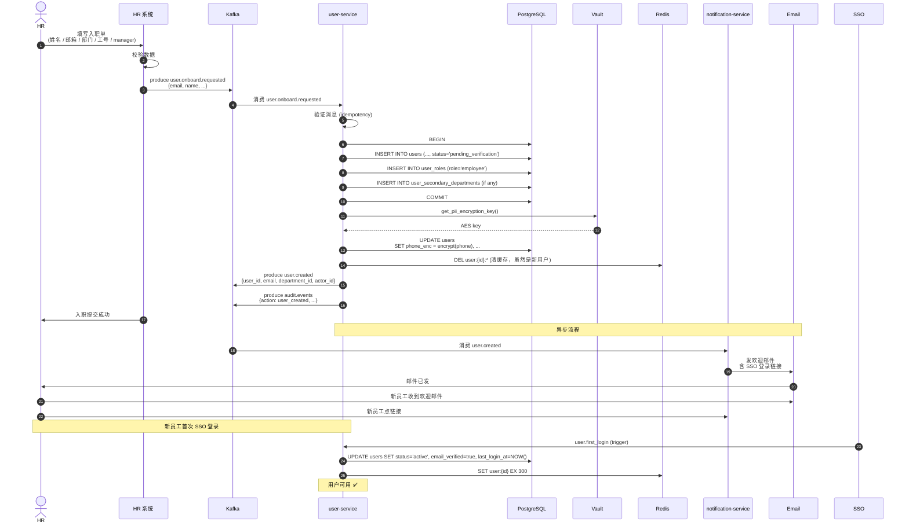

# 入职流程时序图

> 新员工从 HR 提交入职到可用账号的完整流程  
> **目标**：SLO ≤ 5 分钟（PRD.md 场景 1）

---

## 标准入职流程



---

## 关键环节

### 1. HR 提交（HR 系统）

HR 系统在提交入职单时：

```python
# HR 系统侧
def submit_onboarding(payload):
    # 1. 校验
    validate(payload)
    
    # 2. 发 Kafka（替代直接 HTTP 调用）
    kafka.send('user.onboard.requested', {
        'event_id': str(uuid4()),
        'timestamp': now(),
        'payload': payload,
        'retry_count': 0
    })
```

**为什么用 Kafka 而不是 REST？**
- ✅ 异步解耦（HR 系统不阻塞）
- ✅ 失败重试（不丢消息）
- ✅ 流量削峰（早 9 点入职高峰）
- ✅ 完整审计（Kafka 留存 30 天）

### 2. user-service 消费（异步 worker）

```python
# worker 消费
async def handle_onboard(event):
    # 1. 幂等检查
    if await db.scalar(select(User).where(User.email == event.email)):
        return  # 已存在
    
    # 2. 创建用户（事务）
    async with db.begin():
        user = User(
            email=event.email.lower(),
            name=event.name,
            employee_id=event.employee_id,
            primary_department_id=event.department_id,
            manager_id=event.manager_id,
            status='pending_verification',
            hire_date=event.hire_date,
        )
        db.add(user)
        await db.flush()  # 获取 user.id
        
        user_role = UserRole(user_id=user.id, role_id=EMPLOYEE_ROLE_ID)
        db.add(user_role)
    
    # 3. 加密 PII
    pii_key = await vault.get('pii-encryption-key')
    user.phone = encrypt(event.phone, pii_key)
    user.id_card = encrypt(event.id_card, pii_key)
    await db.commit()
    
    # 4. 广播事件
    await kafka.send('user.created', {
        'user_id': str(user.id),
        'email': user.email,
        'department_id': str(user.primary_department_id),
    })
    
    # 5. 审计
    await kafka.send('audit.events', {
        'action': 'user_created',
        'actor_id': event.actor_id,
        'target_id': str(user.id),
    })
```

### 3. SSO 首次登录（激活）

新员工收到欢迎邮件，点链接走 SSO 登录：

```
1. SSO 颁发 JWT（含 email_verified=true claim）
2. user-service 首次收到带 verified claim 的请求
3. UPDATE users SET status='active'
4. 从此正常服务
```

### 4. 失败处理

#### HR 系统 Kafka 发送失败

```python
# HR 系统侧
try:
    kafka.send(...)
except KafkaError:
    # 1. 写到本地 outbox 表
    outbox.insert(payload)
    # 2. 后台 job 重试
    schedule_retry()
```

#### user-service 消费失败

```python
# worker 侧
async def handle_onboard(event):
    try:
        ...
    except Exception:
        # 1. 重试 3 次（指数退避）
        for i in range(3):
            await asyncio.sleep(2 ** i)
            try:
                await handle_onboard(event)
                return
            except: continue
        
        # 2. 进 dead letter
        await kafka.send('user.onboard.dlq', event)
        
        # 3. 告警
        await alert.send('P1', f'Onboard DLQ: {event.email}')
```

#### 部门不存在

```python
# worker 侧
async def handle_onboard(event):
    dept = await get_org(event.department_id)
    if not dept:
        # 1. 写到 pending_department 表
        await db.insert(PendingUser(
            email=event.email,
            payload=event,
            waiting_for='department'
        ))
        # 2. 通知 HR
        await kafka.send('notification.requested', {
            'to': 'hr-team',
            'subject': f'新员工等待部门创建',
            'body': f'员工 {event.email} 的部门 {event.department_id} 不存在',
        })
```

#### Manager 不存在 / 不同部门

```python
# 应用层校验（BR-006）
async def validate_manager(user, manager_id):
    if not manager_id:
        return None
    
    manager = await get_user(manager_id)
    if not manager:
        raise ValidationError('manager_not_found')
    
    # Manager 必须同部门（除高管）
    if (user.primary_department_id != manager.primary_department_id 
        and 'executive' not in manager.roles):
        raise ValidationError('manager_different_department')
    
    return manager_id
```

---

## SLO 监控

| 阶段 | 目标 | 监控 |
|------|------|------|
| HR 提交 → Kafka 入库 | < 1s | HRSys 自监控 |
| Kafka → user-service 消费 | < 5s | Kafka lag |
| user-service 创建 → 提交 DB | < 500ms | API metrics |
| user.created 事件发出 | < 100ms | - |
| notification 收到 → 邮件发出 | < 5s | - |
| 邮件到达 → 用户首次 SSO | 不可控 | - |
| **总耗时（HR 提交 → 账号可用）** | **< 5 min** | E2E 探针 |

### 端到端监控

```python
# E2E 探针（每 5 分钟跑一次）
async def e2e_probe():
    payload = generate_test_onboard()
    start = time.time()
    
    # 1. 发 Kafka
    await kafka.send('user.onboard.requested', payload)
    
    # 2. 等 user.created 事件（最多 60s）
    event = await wait_for_event('user.created', 
                                  filter=lambda e: e['payload']['email'] == payload['email'],
                                  timeout=60)
    
    duration = time.time() - start
    metrics.histogram('onboard_e2e_duration', duration)
    
    if duration > 300:  # 5 分钟
        await alert('P2', f'Onboard E2E slow: {duration}s')
```

---

## 批量入职

一天入职 100+ 人时：

- HR 系统发 100 条 Kafka 消息
- user-service worker 池（10 个并发）消费
- 每条独立处理（无锁竞争）
- 通知异步并发发邮件

```yaml
# k8s deployment
spec:
  replicas: 3  # 3 个 worker pod
  template:
    spec:
      containers:
      - name: user-service-worker
        env:
        - name: WORKER_CONCURRENCY
          value: "10"  # 每个 pod 10 个并发
```

总处理能力：3 × 10 = 30 个/秒  
100 人耗时：~3.3 秒 ✅
