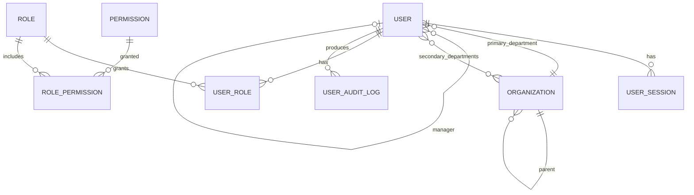

# 领域模型 (Domain Model)

> **项目**: internal-user-service  
> **版本**: v2.1  
> **最后更新**: 2026-06-21

---

## 一、核心实体

```
┌─────────────────────────────────────────────────────────────┐
│                       ORGANIZATION                          │
│  ┌─────────┐    ┌─────────┐    ┌─────────┐                 │
│  │Company  │───>│Dept L1  │───>│Dept L2  │───> Dept L3...   │
│  └─────────┘    └─────────┘    └─────────┘                 │
└─────────────────────────────────────────────────────────────┘
        │             │              │
        │   parent    │  parent      │ parent
        └─────────────┴──────────────┘
                         │
                         │ belongs to
                         ▼
┌─────────────────────────────────────────┐
│                 USER                    │
│  - id (UUID)                            │
│  - email (unique, lowercase)            │
│  - name                                 │
│  - employee_id (E0NNNNNNNN, unique)     │
│  - status: active/dormant/disabled      │
│  - primary_department_id ───────────────┼──> Organization
│  - manager_id ──────────────────────────┼──> User (self-ref)
│  - secondary_departments[] ─────────────┼──> Organization[]
│  - roles[] ─────────────────────────────┼──> Role[]
│  - permissions[] ───────────────────────┼──> Permission[] (effective)
│  - created_at / updated_at / deleted_at │
└─────────────────────────────────────────┘
       │
       │ has many
       ▼
┌─────────────────────────┐
│      USER_SESSION       │    (Redis + DB)
│  - user_id              │
│  - session_id           │
│  - ip / user_agent      │
│  - created_at           │
│  - expires_at           │
│  - revoked_at           │
└─────────────────────────┘

┌─────────────────────────┐
│   USER_AUDIT_LOG        │    (Kafka + S3)
│  - id                   │
│  - user_id              │
│  - actor_id             │
│  - action (login_ok...) │
│  - target               │
│  - ip                   │
│  - timestamp            │
│  - signature (HMAC)     │
└─────────────────────────┘
```

## 二、实体详细定义

| 实体 | 主键 | 关键字段 | 关系 |
|------|------|----------|------|
| **User** | UUID | email, employee_id, status, primary_department_id | N:1 Organization, N:1 User(manager) |
| **Organization** | UUID | name, parent_id, level | 树形自引用 |
| **Role** | UUID | name (employee/manager/admin/super_admin) | N:N User |
| **Permission** | UUID | resource, action, scope | N:N Role |
| **UserSession** | session_id | user_id, expires_at, revoked_at | N:1 User |
| **UserAuditLog** | id | user_id, action, timestamp | N:1 User |

详细字段见各实体文档：
- [entities/user.md](entities/user.md)
- [entities/organization.md](entities/organization.md)
- [entities/permission.md](entities/permission.md)

## 三、状态机

### User.status

```
                    HR 创建
                       │
                       ▼
              ┌─────────────────┐
              │pending_verification│
              └─────────────────┘
                       │
                  首次 SSO
                       │
                       ▼
              ┌─────────────────┐
              │     active      │◀────────┐
              └─────────────────┘         │
                  │     │     │           │ 唤醒
        180d未登录│     │     │禁用        │
                  ▼     │     ▼           │
              ┌────────┐│  ┌────────┐      │
              │dormant ││  │disabled│──────┘
              └────────┘│  └────────┘
                  │     │
            30d未恢复│     │离职
                  ▼     ▼
              ┌─────────────┐
              │  disabled   │
              └─────────────┘
                       │
                  7 年后 + 法务
                       │
                       ▼
              ┌─────────────────┐
              │     物理删除     │
              └─────────────────┘
```

### Permission.grant_status

```
   Admin 授权       Admin 撤销
       │                │
       ▼                ▼
  ┌─────────┐      ┌─────────┐
  │ granted │─────>│ revoked │
  └─────────┘      └─────────┘
       │                │
       │ grace period   │ 即时生效
       │ (7d)           │
       ▼                ▼
    用户可见         用户不可见
```

## 四、关键不变式 (Invariants)

> 这些约束在代码 / DB / 测试三层都必须保证。

| 编号 | 不变式 | 实现层 |
|------|--------|--------|
| INV-1 | 同一邮箱只能有一个 active 用户 | DB unique index + 应用层校验 |
| INV-2 | manager 必须同部门或为高管 | 应用层 + DB trigger |
| INV-3 | 用户至少有一个 role | 应用层强制（默认 employee）|
| INV-4 | 组织树深度 ≤ 6 | 应用层校验 + DB trigger |
| INV-5 | 不能删除自己 | 应用层 |
| INV-6 | 所有写操作必须有审计日志 | 中间件强制 |
| INV-7 | 所有 PII 字段加密 | DB 层 + Vault 集成 |

## 五、关联规则

每个实体都对应：
- **业务规则**: 引用 `docs/requirements/business-rules.md` 的 BR-NNN
- **API 契约**: `docs/api/openapi.yaml` 的端点
- **审计事件**: Kafka topic + 事件 schema
- **测试**: `tests/integration/test_<entity>.py`

## 六、ER 图（简化）



---

## 更新记录

| 版本 | 日期 | 作者 | 变更 |
|------|------|------|------|
| v1.0 | 2025-08-15 | @arch-team | 初版 |
| v2.0 | 2026-01-10 | @arch-team | 加入状态机 + 不变式 |
| v2.1 | 2026-06-21 | @arch-team | 加入 Mermaid 图 |
